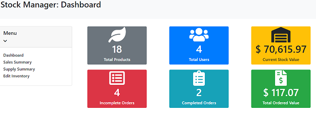
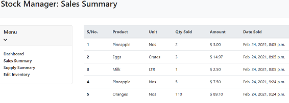
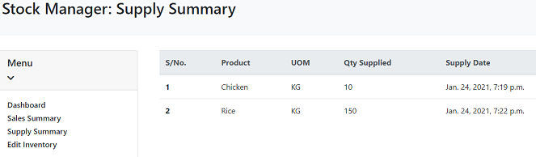
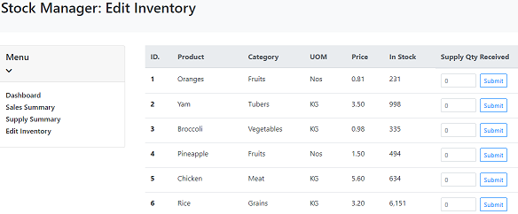
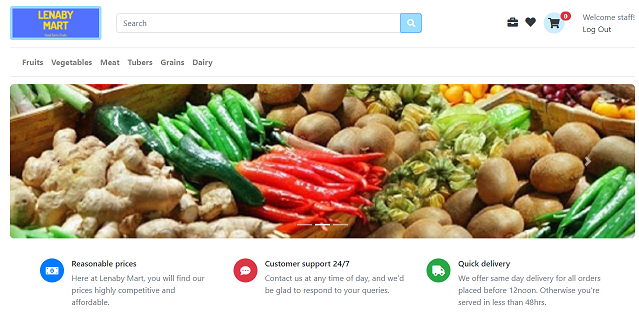

# CS50W_Final Project

CS50’s Web Programming with Python and JavaScript 

## Introduction
 

This project is an Inventory Management
System for a Farm Warehouse which has a section for Staff to manage the farm inventory and another section to allow users place online orders for farm produce.

The project was built using the Django framework on the back-end and JavaScript on the frontend.
The application is mobile-responsive.

## Description
- Registered staff (Staff) of the farm can access the Stock Manager Dashboard to view a summary of all products, number of registered customers,
current stock value, number of completed and incomplete Orders and total placed Order value.

     

- Staff will have access to a sales summary table showing product and corresponding units sold and on what date the sales were made.

     

- Staff will also have access to supply summary table showing the a record of product supplies made to the warehouse and corresponding dates.

     

- Stock quantities can also be updated by staff whenever supplies to the warehouse are received.

     

- Users of the online store section can place orders for farm produce, submit ratings and reviews for products, create a wishlist of products, search for products by name or description or benefits,
add products to a cart, checkout and successfully place orders. 

     

- Each successful order placed auto-decrements the stock quantity of the product in the farm warehouse.
- To see a video demonstration of the application, visit this link => [CS50W_Final_Project](https://youtu.be/qMwpmsuO73w)
## Complexity & Distinctiveness from previous CS50W projects
The following features defend the complexity and distinctiveness of this project from other previous projects in the course:

- This project combines an Inventory Management System from the Staff's point of view with a basic online store.  
  
  

- The applications Front End development (CSS) and mobile responsiveness.
- Incorporation of a summary dashboard, sales and supply table, and edit/update feature of product stock for staff section.
- This projects links the activities of logged in users to the store inventory thereby auto-depreciating the stock quantity of products
after a successful order has been placed.

- In this project, each order has a randomly generated 6-character alphanumeric Unique ID.
- Considerable effort was dedicated to building the Product Star Rating feature. Logged in users of the store can click star icons to submit rating for each product. Built into the Product model is a property for calculating the average of all submitted star
ratings for a farm produce and rendering the appropriate star level to users. 
- Extension of the search functionality beyond product name to product description. Queries return appropriate results for part of a name or part of a description.
- Ability of users to switch (without reloading the page) between paginated view on the home page to viewing all available products on a single page

## Contents of Files created
  - `mart` - main application directory.
    - `static/mart` contains CSS and Javascript files for the application. Also contains specific images like the Logo, Homepage carousel images, etc
        - `cart.js` - script run in `cart.html` template.
        - `category.js` - script run in `category.html`.
        - `checkout.js` - script run in `checkout.html` template.
        - `index.js` - script run in `index.html` template.
        - `product.js` - script run in `product.html` template.
        - `stock.js` - script run in `stock.html` template.
        - `wish.js` - script run in `wishlist.html` template.
        - `styles.css` - hosts CSS for html templates.
    - `templates/mart` contains all application templates.
        - `layout.html` - base template which extends into all other templates.
        - `cart.html` - template shows details of a users cart and order items.
        - `category.html` - template shows warehouse products by chosen category.
        - `checkout.html` - template allows users submit their shipping address, Debit Card details, and then placing an order.
        - `index.html` - home page of the warehouse showing available products, rating and price.
        - `login.html` - template that shows the user login view.
        - `product.html` - template shows product details, long description, price, available stock, product reviews, form for submitting reviews and star ratings,
         'add to cart' functionality, and 'add to wishlist' funcionality.
        - `register.html` - template that shows a new user registration view.
        - `stock.html` - template shows the Stock Management Dashboard and all related functionalities for inventory management.
        - `wishlist.html` - template shows a listing of all products added to a wishlist by a logged in user.
    - `admin.py` - contains a registration of all the applications models
    - `models.py` contains six models used in the project.
    - `urls.py` - contains all the application URLs as well as the `API` routes for the project.
    - `views.py` - contains all the application views and API logic.
  - `media` - this directory contains photos of all products in the warehouse.
  - `projectfinal` - project directory.
  - `db.sqlite3` - contains the applications database.
  

## How to run app
From main file directory

- Make and apply migrations

   run `python manage.py makemigrations`
   
   run `python manage.py migrate`

- Create superuser (to get access to Inventory Management section of app), enter username and password

    `python manage.py createsuperuser`

- Run server

    `python manage.py runserver`
    
- In your browser, visit the app under the development server IP

  - On the homepage, login with superuser details to access Inventory Management or Register 
  as a normal user to test features of the online store.
  
## Additional Information
For site administration purposes, Images of Products must be 200 x 200 pixels.

Thanks to CS50W staff for this learning opportunity, not always been easy, but i'm enjoying every bit of the journey.
